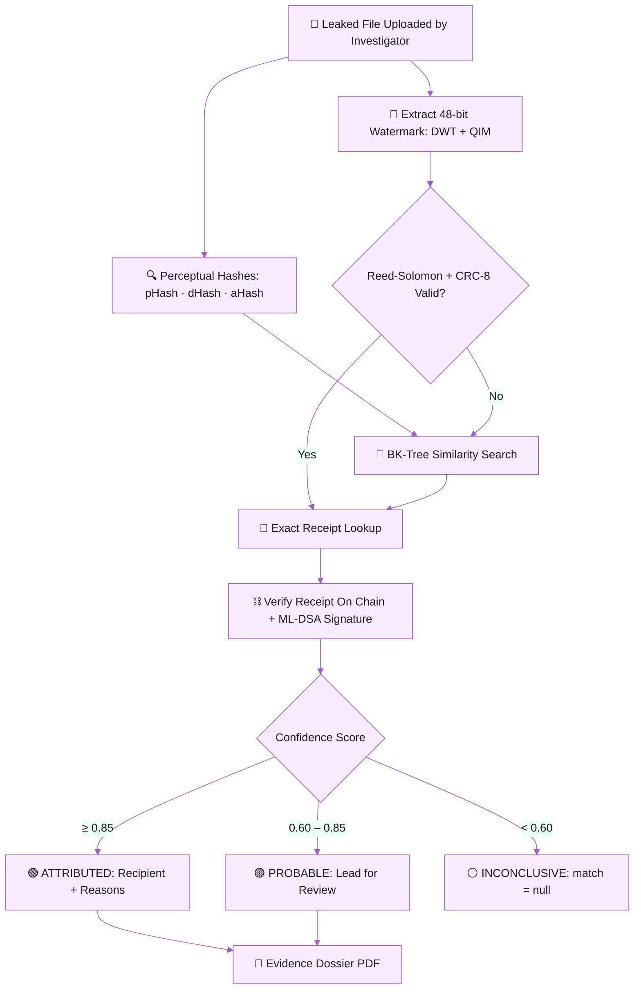
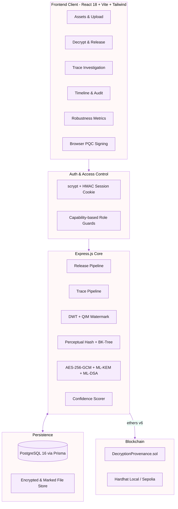
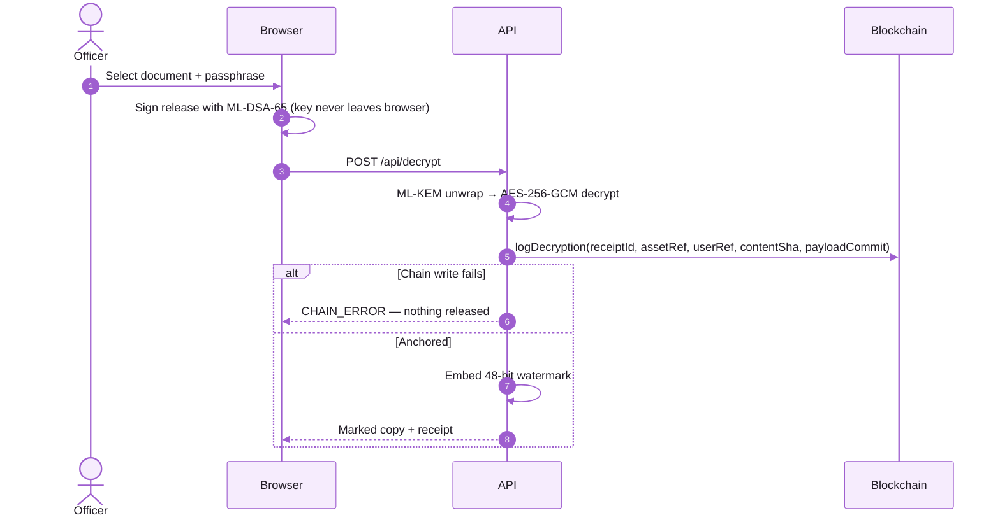
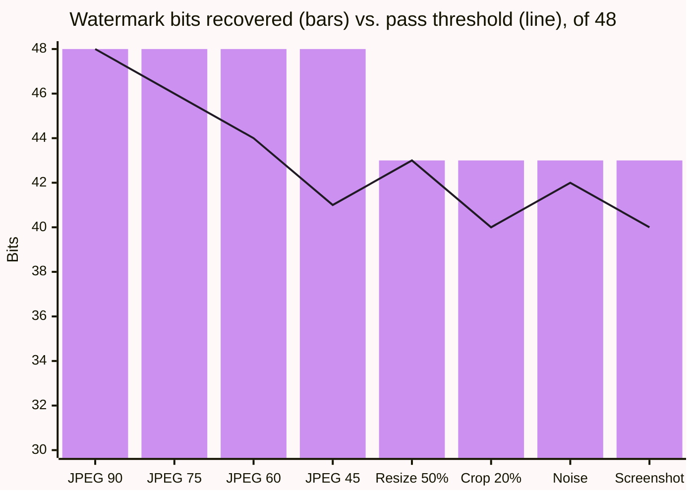

<div align="center">


<br/>

<a href="#-how-it-works">
  
</a>

<br/>

[](https://react.dev/)
[](https://nodejs.org/)
[](https://www.postgresql.org/)
[](https://soliditylang.org/)
[](https://csrc.nist.gov/projects/post-quantum-cryptography)

<br/>


<br/>

> **🔏 "A leaked document should lead back to the copy it came from — and never to a guess."**

[🏗️ **ARCHITECTURE**](#-system-architecture) &nbsp;•&nbsp; [📊 **ROBUSTNESS**](#-robustness) &nbsp;•&nbsp; [🚀 **QUICKSTART**](#-quickstart) &nbsp;•&nbsp; [📑 **DOCS**](docs/)

</div>

---

<br/>

<div align="center">
  
</div>

<br/>

When a classified document leaks, the usual question — _who leaked it?_ — tends to
end in suspicion rather than proof. **Decryption Provenance** (Smart India
Hackathon 2026, **SIH26237**) makes every release traceable, and refuses to name
anyone the evidence does not support:

- **⛓️ Receipt Before Release:** A receipt is written to a smart contract _before_ the plaintext leaves the system. If the chain write fails, no copy is released — a marked file can never exist without its record.
- **🔏 Invisible Per-Recipient Watermark:** A 48-bit payload is hidden in the frequency domain (2-level Haar DWT + QIM), protected by **Reed-Solomon (12,6)** and **CRC-8**, at **48 dB PSNR** — visually identical to the original.
- **🛡️ Survives Real Leaks:** Recovered after JPEG recompression, 50% resize, 20% crop, noise and screenshot capture — **8 / 8 attacks passed**.
- **⚖️ Never Guesses a Name:** Three verdict bands with plain-language reasons. Below 60% confidence the API returns `match: null` — the UI never receives a name it is not allowed to show.
- **⚛️ Post-Quantum Ready:** Content keys wrapped with **ML-KEM-768** (FIPS 203); every release signed in the browser with **ML-DSA-65** (FIPS 204), its commitment anchored on chain.
- **🕵️ Privacy by Design:** Only hashes reach the blockchain. Names, departments and devices stay in PostgreSQL.
- **📄 Images & PDFs:** PDFs carry a metadata mark plus a rasterized DWT tile on every page; each investigation exports an **evidence dossier PDF**.

<br/>

<div align="center">
  
</div>

<br/>

---

<div align="center">
  
</div>

<br/>

A leaked file is examined along **two independent paths** — the watermark says
_which receipt_, the perceptual hashes say _which file_. Agreement earns
confidence; disagreement lowers it.



### 🔬 Core Engines

1. **🧬 Watermark Engine** (`watermark.js`): 2-level Haar DWT with QIM in the HL/LH sub-bands, HMAC-keyed coefficient permutation.
2. **🧱 Error Correction** (`ecc.js`, `payload.js`): Pure-JS Reed-Solomon (12,6) + CRC-8 over a 36-bit receipt id.
3. **🔍 Perceptual Matcher** (`phash.js`, `bktree.js`): pHash (2D-DCT), dHash, aHash with a BK-tree over Hamming distance.
4. **⚖️ Confidence Scorer** (`confidence.js`): 45% watermark bits · 25% pHash · 15% dHash · 10% aHash · 5% on-chain verification.
5. **⚛️ PQC Module** (`pqc.js`): ML-KEM-768 key encapsulation and ML-DSA-65 non-repudiation signatures.

<br/>

---

<div align="center">
  
</div>

<br/>



### 🔄 Release Sequence



<br/>

---

<div align="center">
  
</div>

<br/>

Measured with `npm run attack:suite` ([`test/metrics.json`](test/metrics.json)) at the default QIM step δ = 12.



| Attack                         | Bits Recovered |     Threshold     | Result |
| :----------------------------- | :------------: | :---------------: | :----: |
| JPEG quality 90 / 75 / 60 / 45 |    48 / 48     | 48 / 46 / 44 / 41 |   ✅   |
| Resize 50%                     |    43 / 48     |        43         |   ✅   |
| Crop 20%                       |    43 / 48     |        40         |   ✅   |
| Gaussian noise                 |    43 / 48     |        42         |   ✅   |
| Screenshot simulation          |    43 / 48     |        40         |   ✅   |

<br/>

---

<div align="center">
  
</div>

<br/>

Each role is deliberately missing a power, so no single person can both create and investigate a leak:

| Role           | Label                      | Access Policy                                                                                                       |
| :------------- | :------------------------- | :------------------------------------------------------------------------------------------------------------------ |
| `ADMIN`        | **Registry Administrator** | Uploads documents, releases copies to anyone, runs investigations, reads the full audit trail.                      |
| `OFFICER`      | **Clearance Holder**       | Releases a watermarked copy **to themselves only**. Cannot trace — nobody investigates their own leak.              |
| `INVESTIGATOR` | **Forensic Analyst**       | Traces leaked files and reads the audit trail. **Cannot decrypt** — so cannot manufacture the leak they "discover". |

> 🔒 _Permissions live in one file, [`server/lib/permissions.js`](server/lib/permissions.js). The API enforces them; the client only hides what a role cannot do. An officer calling `/api/trace` receives `403 FORBIDDEN`._

<br/>

---

<div align="center">
  
</div>

<br/>

<div align="center">
  
</div>

<br/>

| Layer            | Technology                                                                  |
| :--------------- | :-------------------------------------------------------------------------- |
| **Frontend**     | React 18, Vite, Tailwind CSS, React Router, TanStack Query, Recharts        |
| **Backend**      | Node.js 20, Express, Zod, Multer                                            |
| **Imaging**      | sharp, Jimp, pdf-lib — custom Haar DWT, QIM, pHash / dHash / aHash, BK-tree |
| **Cryptography** | AES-256-GCM, scrypt, `@noble/post-quantum` (ML-KEM-768, ML-DSA-65)          |
| **Database**     | PostgreSQL 16, Prisma ORM                                                   |
| **Blockchain**   | Solidity 0.8.24, OpenZeppelin AccessControl, Hardhat, ethers v6, Sepolia    |

<br/>

---

<div align="center">
  
</div>

<br/>

- [x] **Phase 1:** AES-256-GCM vault, DWT + QIM watermark, Reed-Solomon payload codec.
- [x] **Phase 2:** On-chain receipts, perceptual hash BK-tree, three-band confidence scoring.
- [x] **Phase 3:** Role-based access, post-quantum key wrap and signatures, PDF watermarking.
- [x] **Phase 4:** Evidence dossier export, Sepolia deployment, attack-suite benchmarks.
- [ ] **Phase 5:** Merkle-batched receipt anchoring (one transaction per batch).
- [ ] **Phase 6:** Full-page raster watermark extraction for printed-and-scanned PDFs.

<br/>

---

<div align="center">
  
</div>

<br/>

### 1️⃣ Clone & Install

```bash
git clone https://github.com/hayan9104/Crypto-2.git
cd Crypto-2
npm run setup            # root + client deps, Prisma client
```

### 2️⃣ Configure

Create `.env` in the project root with at least `DATABASE_URL`, `MASTER_KEY_HEX`,
`REF_SALT`, `AUTH_SECRET`, `WATERMARK_SEED` and `CHAIN_MODE` (`local` · `sepolia` · `off`).

### 3️⃣ Database, Chain & Launch

```bash
docker run --name sih-pg -e POSTGRES_PASSWORD=dev -p 5432:5432 -d postgres:16
npm run db:migrate
npm run db:seed          # demo accounts, one per role

npm run chain:node       # terminal 1 — local blockchain
npm run chain:deploy:local   # terminal 2 — copy address to LOCAL_CONTRACT_ADDRESS

npm run dev              # API → http://localhost:4000
npm run client:dev       # UI  → http://localhost:5173
```

Sign in as `admin@example.gov` / `admin123` to reach every screen.

### 4️⃣ Test

```bash
npm run test:smoke       # payload codec + BK-tree
npm run attack:suite     # watermark robustness benchmark
npm run chain:test       # smart contract tests
```

<br/>

---

<div align="center">


_Decryption Provenance — SIH26237 · Released under the [MIT License](LICENSE)._ 🇮🇳

</div>
