<div align="center">


<br/>

<a href="https://github.com/hayan9104/Crypto-2">
  
</a>

<br/><br/>


<br/>


<br/><br/>

**Tracing the source of a leaked classified document —<br/>without ever accusing anyone the evidence does not support.**

[How it works](#-how-it-works) ·
[Architecture](#-architecture) ·
[Flows](#-flows) ·
[Robustness](#-robustness) ·
[Tech stack](#-tech-stack) ·
[Setup](#-setup) ·
[API](#-api)

</div>


## ✦ The idea

When a protected file is decrypted, the system does two things before the
plaintext is released: it writes an **immutable receipt to a blockchain**, and it
embeds an **invisible, per-recipient watermark** into the copy that is handed
over. If that copy later leaks — compressed, resized, cropped, or photographed
off a screen — the mark can still be recovered and matched back to the receipt.

Built for SIH problem statement **SIH26237**. Node.js + React + PostgreSQL,
**CPU only**: no GPU, no model, no training data.

<table>
<tr>
<td width="33%" valign="top">

### 🔏 Mark every copy

A 48-bit payload is hidden in the frequency domain of each released copy
(2-level Haar DWT + QIM), protected by Reed-Solomon and a CRC-8.

</td>
<td width="33%" valign="top">

### ⛓️ Anchor every release

The receipt is written on chain **before** the mark is embedded.
No receipt, no copy — a marked file cannot exist without its record.

</td>
<td width="33%" valign="top">

### ⚖️ Refuse to guess

Verdicts come in three bands with plain-English reasons. Below 60%
the API returns `match: null` — the UI never receives a name it may not show.

</td>
</tr>
</table>

<div align="center">

</div>


## ◈ How it works

**Release.** Decrypt (AES-256-GCM) → hash the exact bytes → derive a receipt id
→ anchor `{receiptId, assetRef, userRef, contentSha, payloadCommit}` on chain →
embed the 48-bit payload with a 2-level Haar DWT and QIM in the HL/LH sub-bands
→ index the perceptual hashes → record the event.

> [!IMPORTANT]
> The chain write happens **before** the watermark is embedded. If it fails, no
> marked file is ever released, so a marked copy cannot exist without a receipt.

**Trace.** Hash the leaked file → search the BK-tree index → extract the
watermark → look up the receipt → verify it on chain → score.

Two independent paths converge: the **watermark** identifies _which receipt_
(exact, but fragile under heavy attack) and the **perceptual hashes** identify
_which file_ (fuzzy, but survives a screenshot). Agreement earns confidence;
disagreement lowers it.

### The verdict is a band, never a name on its own

| Band              |      Score      | Meaning                     |
| :---------------- | :-------------: | :-------------------------- |
| 🟢 `ATTRIBUTED`   |   **≥ 0.85**    | Report the match            |
| 🟡 `PROBABLE`     | **0.60 – 0.85** | A lead, not a conclusion    |
| ⚪ `INCONCLUSIVE` |   **< 0.60**    | Report that it is not known |

Every verdict carries `reasons[]` in plain sentences — _"46/48 watermark bits
recovered (2 fixed by Reed-Solomon)"_, not _"bitConfidence=0.958"_. A score that
cannot be reviewed is not evidence.


## ⬡ Architecture

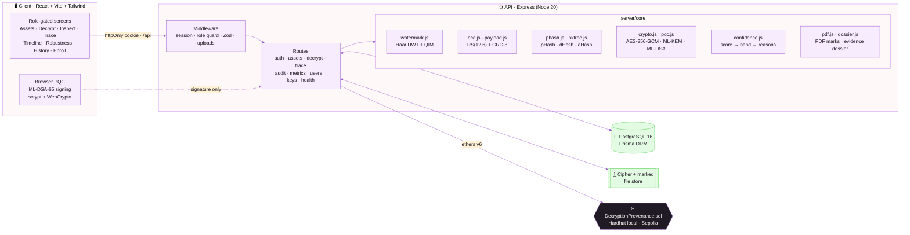


## ⟿ Flows

### 1 · Release a copy (`POST /api/decrypt`)

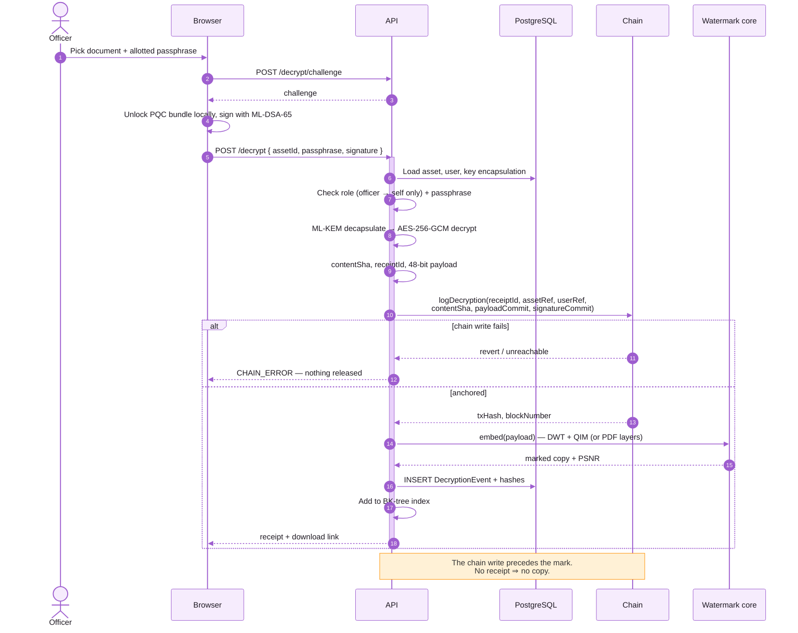

### 2 · Trace a leak (`POST /api/trace`)

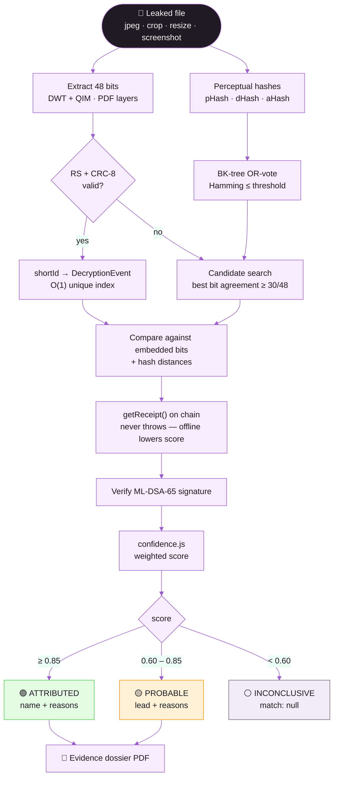

### 3 · The verdict lifecycle

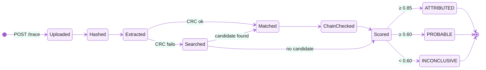

### 4 · The 48-bit payload

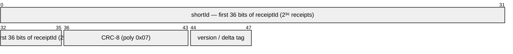

`48 bits → Reed-Solomon (12, 6) → 96 bits → spread with redundancy across keyed,
HMAC-permuted DWT coefficients.` The `shortId → receiptId` mapping is stored in
`DecryptionEvent.shortId`, so the full 32-byte receipt is always recoverable.


## ◐ Scoring

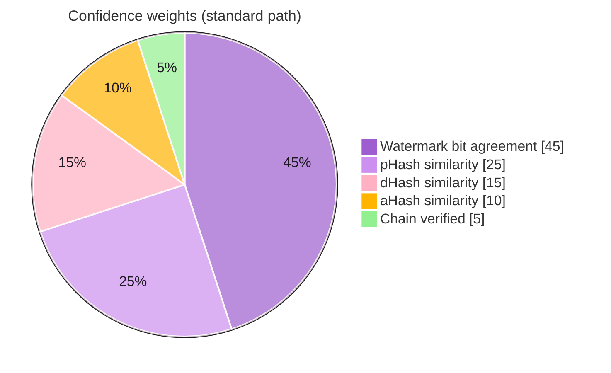

```text
score = 0.45 · bitAgreement
      + 0.25 · (1 − pHashDist / 64)
      + 0.15 · (1 − dHashDist / 64)
      + 0.10 · (1 − aHashDist / 64)
      + 0.05 · chainVerified
```

> [!NOTE]
> **Screenshot path.** When both pHash and dHash distances exceed 28 (a phone
> bezel or window frame has swamped the image) but ≥ 31/48 watermark bits still
> agree, the frequency-domain mark becomes the primary witness:
> `0.72 · bits + 0.13 · best-hash + 0.15 · chain`.


## ▲ Robustness

Measured by `npm run attack:suite` → [`test/metrics.json`](test/metrics.json).
Every attack clears its target; the marked image stays at **48.07 dB PSNR**
(visually indistinguishable) at the default `δ = 12`.

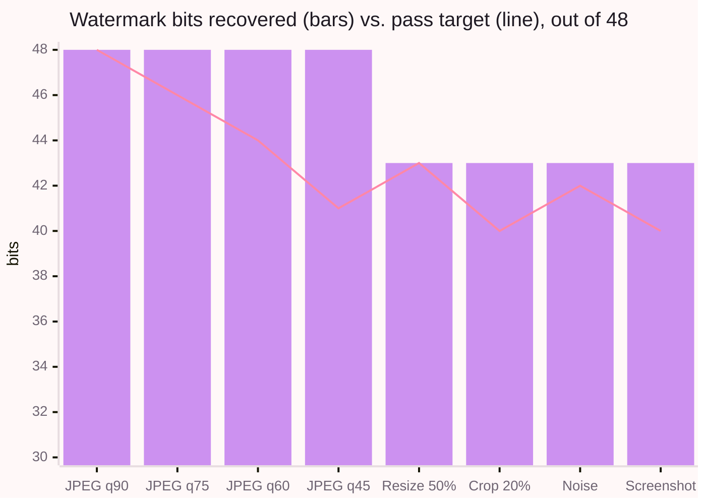

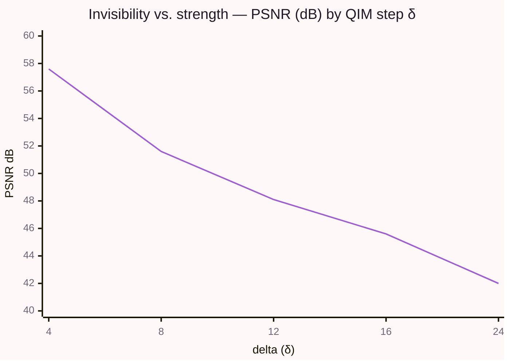

| Attack                | Bits recovered | Target | Result |
| :-------------------- | :------------: | :----: | :----: |
| JPEG q90              |    48 / 48     |   48   |   ✅   |
| JPEG q75              |    48 / 48     |   46   |   ✅   |
| JPEG q60              |    48 / 48     |   44   |   ✅   |
| JPEG q45              |    48 / 48     |   41   |   ✅   |
| Resize 50%            |    43 / 48     |   43   |   ✅   |
| Crop 20%              |    43 / 48     |   40   |   ✅   |
| Gaussian noise        |    43 / 48     |   42   |   ✅   |
| Screenshot simulation |    43 / 48     |   40   |   ✅   |


## ◉ Privacy

No personal data reaches the blockchain. The only identity on chain is
`keccak256(userId || salt)`; names, departments and devices live in PostgreSQL
and never leave it.

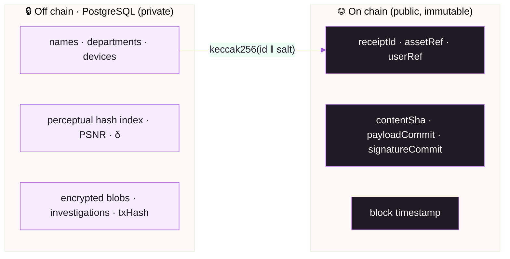

`payloadCommit` is written at decryption time, so the block timestamp proves the
watermark **predates** any leak rather than being constructed after one.

<details>
<summary><b>🗃️ Data model (ER diagram)</b></summary>

<br/>

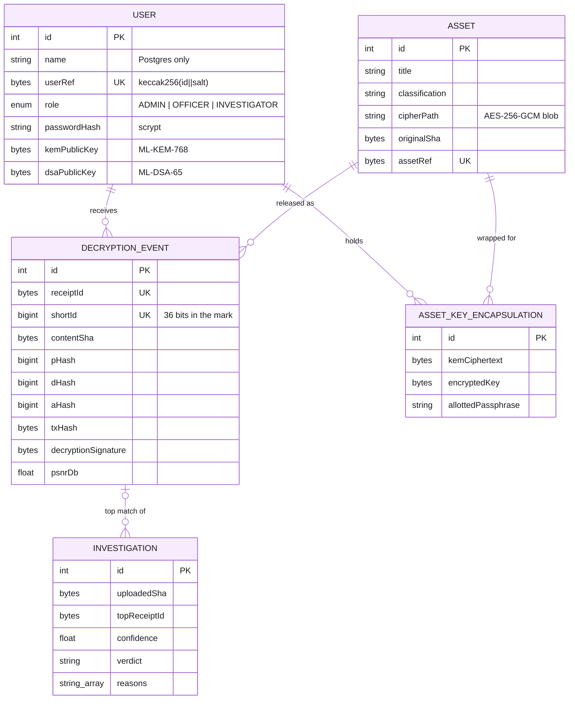

</details>


## ◇ Roles

Sign-in is required for everything except `/api/health`. The split is the same
separation-of-duties argument the verdict bands rest on.

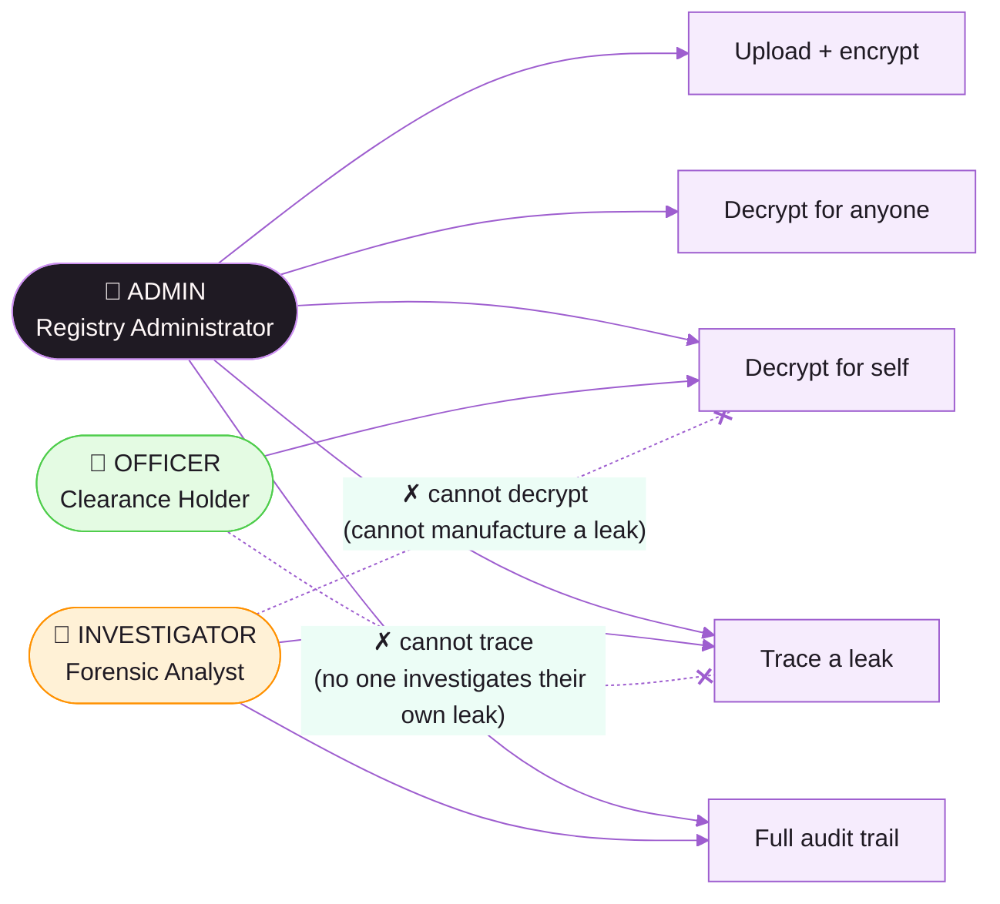

| Role           | Lands on   | Documents    | Decrypt       | Trace | Timeline   | Robustness |
| :------------- | :--------- | :----------- | :------------ | :---: | :--------- | :--------: |
| `ADMIN`        | `/assets`  | view, upload | anyone        |  ✅   | everyone's |     ✅     |
| `OFFICER`      | `/decrypt` | view         | **self only** |  ❌   | own only   |     ✅     |
| `INVESTIGATOR` | `/trace`   | view         | ❌            |  ✅   | everyone's |     ✅     |

[`server/lib/permissions.js`](server/lib/permissions.js) is the only place this
table lives. The API enforces it; the frontend reads the same capability list off
`/api/auth/me` and hides what it cannot do. **Hiding a button is a courtesy — the
refusal is the control.**

<details>
<summary><b>🔑 Seeded demo accounts</b></summary>

<br/>

`npm run db:seed` prints these:

| Role           | Email                                                        | Password     |
| :------------- | :----------------------------------------------------------- | :----------- |
| `ADMIN`        | `admin@example.gov`                                          | `admin123`   |
| `OFFICER`      | `u017@example.gov` · `u023@example.gov` · `u041@example.gov` | `officer123` |
| `INVESTIGATOR` | `a004@example.gov`                                           | `analyst123` |

Sessions are an httpOnly, SameSite=Lax cookie holding an HMAC-signed token
(`AUTH_SECRET`, 12 h by default). Passwords are scrypt. Both are built on
`node:crypto` — no bcrypt, no jsonwebtoken.

</details>


## ⚛ Post-quantum layer

| Purpose                                   | Algorithm                 | Standard      | Where                                          |
| :---------------------------------------- | :------------------------ | :------------ | :--------------------------------------------- |
| Per-recipient content-key wrap            | **ML-KEM-768** (Kyber)    | NIST FIPS 203 | `server/core/pqc.js`                           |
| Non-repudiation signature on each release | **ML-DSA-65** (Dilithium) | NIST FIPS 204 | `client/src/lib/pqc.js` → `server/core/pqc.js` |
| Private key bundle at rest                | AES-256-GCM + scrypt      | —             | unlocked **in the browser only**               |

The officer's private key never leaves the browser. Only the 3,309-byte ML-DSA-65
signature is sent to the server, and its `keccak256` commitment is anchored on
chain next to the receipt. Built on `@noble/post-quantum` — pure JS, works
air-gapped.


## ⚒ Tech stack

<div align="center">


</div>

<br/>

| Layer        | Tools                                                                                                                     |
| :----------- | :------------------------------------------------------------------------------------------------------------------------ |
| **Frontend** | React 18 · Vite 5 · Tailwind CSS 3 · React Router 6 · TanStack Query · Recharts · Axios · wagmi / viem                    |
| **Backend**  | Node.js 20 · Express 4 · Zod · Multer · Nodemon                                                                           |
| **Imaging**  | sharp · Jimp · sharp-phash · pdf-lib — custom Haar DWT, QIM, pHash/dHash/aHash, BK-tree                                   |
| **Crypto**   | `node:crypto` (AES-256-GCM, SHA-256, scrypt, HMAC) · `@noble/post-quantum` (ML-KEM-768, ML-DSA-65) · pure-JS Reed-Solomon |
| **Data**     | PostgreSQL 16 · Prisma 5                                                                                                  |
| **Chain**    | Solidity 0.8.24 · OpenZeppelin AccessControl · Hardhat · ethers v6 · Sepolia                                              |
| **Quality**  | ESLint 9 · Prettier · Hardhat + Chai tests · GitHub Actions CI                                                            |
| **Design**   | Chromia identity tokens · Fraunces · Inter · Sniglet · JetBrains Mono                                                     |

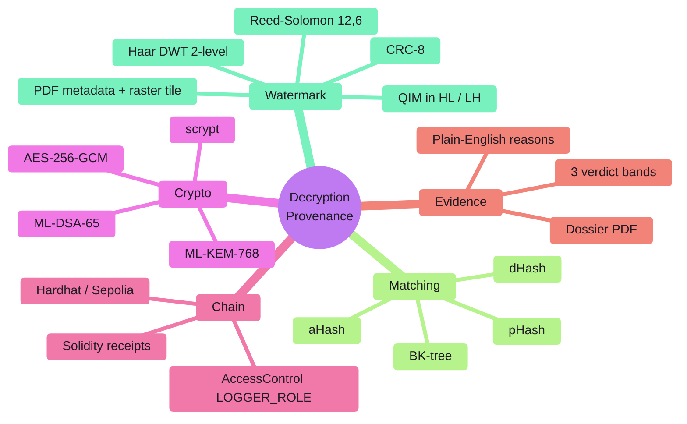


## ⚡ Setup

> **Requires** Node 20+, PostgreSQL 16, and npm.

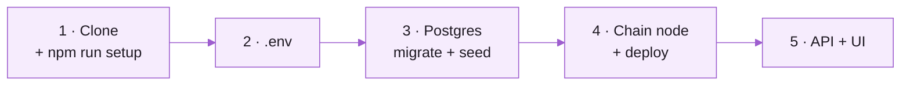

**1 · Clone and install**

```bash
git clone https://github.com/hayan9104/Crypto-2.git
cd Crypto-2
npm run setup                 # root + client deps, generates Prisma client
```

**2 · Environment** — create `.env` in the repo root (it is git-ignored).

<details>
<summary><b>Environment variables</b></summary>

<br/>

| Key                                                                                          | Purpose                                    |
| :------------------------------------------------------------------------------------------- | :----------------------------------------- |
| `PORT` · `NODE_ENV` · `CORS_ORIGIN`                                                          | API server                                 |
| `DATABASE_URL`                                                                               | PostgreSQL connection string               |
| `MASTER_KEY_HEX`                                                                             | 32-byte hex key for AES-256-GCM            |
| `REF_SALT`                                                                                   | salt for `assetRef` / `userRef` hashing    |
| `AUTH_SECRET` · `SESSION_TTL_HOURS`                                                          | session token signing and lifetime         |
| `WATERMARK_DELTA` · `WATERMARK_SEED`                                                         | QIM step and keyed coefficient permutation |
| `CHAIN_MODE`                                                                                 | `local` · `sepolia` · `off`                |
| `LOCAL_RPC_URL` · `LOCAL_CONTRACT_ADDRESS` · `LOCAL_PRIVATE_KEY`                             | Hardhat node                               |
| `SEPOLIA_RPC_URL` · `SEPOLIA_CONTRACT_ADDRESS` · `SEPOLIA_PRIVATE_KEY` · `ETHERSCAN_API_KEY` | testnet                                    |
| `CIPHER_DIR` · `MARKED_DIR` · `MAX_UPLOAD_MB`                                                | file storage                               |
| `BKTREE_MAX_DIST`                                                                            | Hamming radius for candidate search        |

</details>

**3 · Database**

```bash
docker run --name sih-pg -e POSTGRES_PASSWORD=dev -p 5432:5432 -d postgres:16
npm run db:migrate
npm run db:seed               # demo accounts + encrypted documents
```

**4 · Contract**

```bash
npm run chain:node            # terminal 1, leave running
npm run chain:deploy:local    # terminal 2, prints the address
# put the printed address in .env as LOCAL_CONTRACT_ADDRESS
```

`CHAIN_MODE` selects `local`, `sepolia` or `off`. Sepolia gives a publicly
verifiable Etherscan link; fund the wallet from a faucet well in advance.

**5 · Run**

```bash
npm run dev                   # API  → http://localhost:4000
npm run client:dev            # UI   → http://localhost:5173
```

Sign in with `admin@example.gov` / `admin123` to reach every screen.
`GET /api/health` reports database, chain and index status, and lists anything
degraded in `warnings`.


## ⇄ API

Base path `/api`. Every failure returns `{ "error": { "code", "message" } }`.

<details open>
<summary><b>Endpoints</b></summary>

<br/>

| Method | Route                                   | Purpose                                                           | Who                       |
| :----- | :-------------------------------------- | :---------------------------------------------------------------- | :------------------------ |
| `GET`  | `/health`                               | Database, chain and index status                                  | anyone                    |
| `POST` | `/auth/login`                           | Sign in, sets an httpOnly session cookie                          | anyone                    |
| `POST` | `/auth/logout`                          | Clear the session                                                 | anyone                    |
| `GET`  | `/auth/me`                              | The current session and its capabilities                          | signed in                 |
| `GET`  | `/assets`                               | List protected documents                                          | signed in                 |
| `POST` | `/assets`                               | Upload and encrypt (multipart: `file`, `title`, `classification`) | admin                     |
| `GET`  | `/assets/:id`                           | One document, with its refs                                       | signed in                 |
| `GET`  | `/users`                                | Officers, with their hashed `userRef`                             | all; an officer gets self |
| `POST` | `/decrypt/challenge`                    | Nonce for the ML-DSA-65 release signature                         | admin, officer            |
| `POST` | `/decrypt`                              | Release a watermarked copy and anchor the receipt                 | admin; officer for self   |
| `POST` | `/decrypt/batch`                        | Allot passphrases and release to several officers                 | admin                     |
| `GET`  | `/decrypt/allotments/:assetId`          | Passphrase allotments for a document                              | admin, officer            |
| `POST` | `/decrypt/allotments/:assetId/reveal`   | Reveal your allotted passphrase (password re-check)               | admin, officer            |
| `GET`  | `/decrypt/releases/:assetId`            | Released copies of a document                                     | admin                     |
| `POST` | `/decrypt/inspect/:receiptId`           | Re-extract the mark from a released copy                          | admin                     |
| `POST` | `/trace`                                | Attribute a leaked file (multipart: `file`)                       | admin, investigator       |
| `GET`  | `/trace/investigations`                 | Recent investigations                                             | admin, investigator       |
| `GET`  | `/trace/:id/dossier`                    | Evidence dossier PDF for an investigation                         | admin, investigator       |
| `GET`  | `/audit/global`                         | Access timeline across every document                             | admin, investigator       |
| `GET`  | `/audit/:assetId`                       | Per-document access timeline                                      | all; officer gets own     |
| `GET`  | `/keys/public/:userId` · `/keys/bundle` | PQC public keys · your encrypted key bundle                       | signed in                 |
| `POST` | `/keys/generate`                        | Enrol: generate an ML-KEM + ML-DSA key pair                       | signed in                 |
| `GET`  | `/metrics`                              | Watermark robustness measurements                                 | signed in                 |
| `GET`  | `/files/marked/:receiptId`              | Download a released copy                                          | admin, or the recipient   |

**Error codes:** `BAD_INPUT` · `UNAUTHENTICATED` · `FORBIDDEN` · `NOT_FOUND` ·
`PAYLOAD_TOO_LARGE` · `UNSUPPORTED_MEDIA` · `CHAIN_ERROR` · `CORE_NOT_READY` ·
`INTERNAL`

</details>


## ▤ Layout

```
contracts/          DecryptionProvenance.sol — role-gated receipt register
scripts/            deployment
prisma/             schema · migrations · seed
server/
  index.js          Express app and boot sequence
  routes/           auth · assets · decrypt · trace · audit · metrics · users · keys · health
  middleware/       Zod validation · uploads · session + role guards · error shape
  lib/              config · Prisma client · ref hashing · auth · permissions · errors
  core/
    watermark.js    Haar DWT + QIM embed / extract
    pdf.js          PDF metadata + rasterized DWT tile
    phash.js        pHash · dHash · aHash
    bktree.js       BK-tree over perceptual hashes
    crypto.js       AES-256-GCM · SHA-256 · MD5
    pqc.js          ML-KEM-768 · ML-DSA-65
    ecc.js          Reed-Solomon (12, 6)
    payload.js      48-bit payload codec + CRC-8
    psnr.js         quality measurement
    confidence.js   score → band → reasons
    chain.js        ethers v6 contract wrapper
    dossier.js      evidence dossier PDF
client/             React + Vite + Tailwind dashboard (login, role-gated routes)
test/               smoke test · attack suite · PQC end-to-end · contract tests
docs/               contracts · demo script · pitch deck · README assets
```

## ⌘ Commands

| Command                                                     | Purpose                                                   |
| :---------------------------------------------------------- | :-------------------------------------------------------- |
| `npm run dev`                                               | API with reload                                           |
| `npm run client:dev`                                        | Frontend dev server (proxies `/api`)                      |
| `npm run test:smoke`                                        | Payload codec and BK-tree — no install or database needed |
| `npm run attack:suite`                                      | Eight attacks against the watermark → `test/metrics.json` |
| `npm run chain:test`                                        | Contract tests                                            |
| `npm run db:migrate` · `db:seed` · `db:studio` · `db:reset` | Prisma                                                    |
| `npm run lint` · `npm run format`                           | ESLint, Prettier                                          |

### Continuous integration

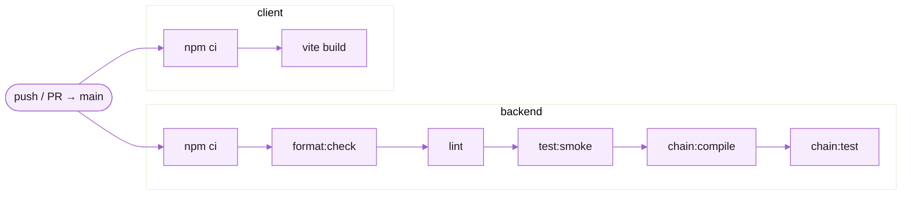


## ✎ Contributing

Ownership is split three ways and each file header states its owner; do not edit
a file you do not own. Only one person runs `prisma migrate dev` — everyone else
runs `npx prisma migrate deploy && npx prisma generate`, so the migration history
stays linear.

## ⚖ License

MIT — see [LICENSE](LICENSE).

<div align="center">

<br/>


<sub>Built for Smart India Hackathon 2026 · SIH26237</sub>

</div>
