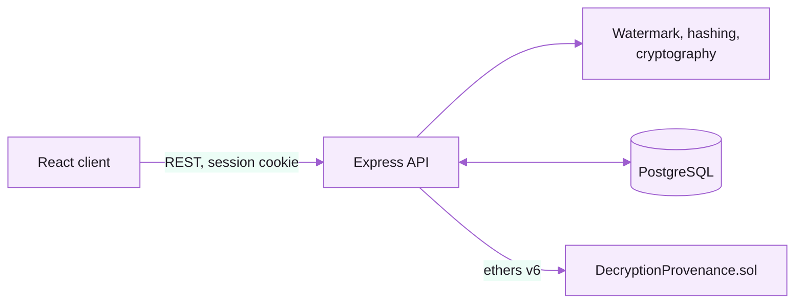
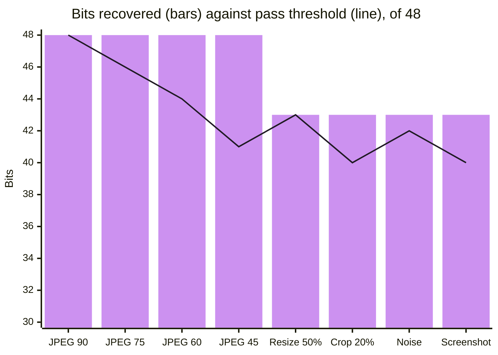

<div align="center">


<p>
  <strong>Forensic leak attribution for classified documents.</strong><br/>
  Every release is watermarked per recipient and anchored on chain, so a leaked copy can be traced back to the receipt it came from.
</p>

<p>
  <a href="https://github.com/hayan9104/Crypto-2/actions/workflows/ci.yml"></a>
  = 20"/>
  
  
  <a href="LICENSE"></a>
</p>

<p>
  <a href="#overview">Overview</a> ·
  <a href="#how-it-works">How it works</a> ·
  <a href="#robustness">Robustness</a> ·
  <a href="#access-control">Access control</a> ·
  <a href="#getting-started">Getting started</a> ·
  <a href="docs/">Docs</a>
</p>

</div>

## Overview

Decryption Provenance answers one question after a leak: _which released copy
is this?_ It was built for Smart India Hackathon 2026, problem statement
**SIH26237**.

Before any plaintext leaves the system, two things happen: a receipt is written
to a smart contract, and an invisible 48-bit watermark identifying that receipt
is embedded in the copy. If the copy later surfaces — recompressed, resized,
cropped or photographed off a screen — the watermark and perceptual hashes are
recovered and matched back to the receipt.

The system is designed to avoid false accusations. It reports a confidence band
with plain-language reasons, and below 60% confidence it returns no name at all.
Everything runs on a CPU; there is no model and no training data.


## How it works

**Release.** The document is decrypted (AES-256-GCM, content key wrapped with
ML-KEM-768), the recipient signs the release with ML-DSA-65, and the receipt is
anchored on chain. Only then is the payload embedded using a two-level Haar DWT
with QIM in the HL/LH sub-bands. If the chain write fails, no copy is released.

**Trace.** A leaked file is hashed (pHash, dHash, aHash) and searched in a
BK-tree index, while the watermark is extracted and corrected with Reed-Solomon
and CRC-8. Both signals are matched to a receipt, verified on chain, and scored.



### Attribution confidence

| Verdict        | Score       | Result                                    |
| :------------- | :---------- | :---------------------------------------- |
| `ATTRIBUTED`   | ≥ 0.85      | Recipient is reported with reasons        |
| `PROBABLE`     | 0.60 – 0.85 | Reported as a lead requiring review       |
| `INCONCLUSIVE` | < 0.60      | `match: null`; no identity leaves the API |

The score combines watermark bit agreement (45%), pHash, dHash and aHash
similarity (25 / 15 / 10%) and on-chain verification (5%). See
[`server/core/confidence.js`](server/core/confidence.js).

### Privacy

The contract stores only hashes: `receiptId`, `assetRef`, `userRef`
(`keccak256(userId ‖ salt)`), `contentSha`, `payloadCommit` and a signature
commitment. Names, departments and devices stay in PostgreSQL.

## Robustness

Results from `npm run attack:suite` ([`test/metrics.json`](test/metrics.json)),
at the default QIM step δ = 12 and 48.07 dB PSNR.



## Access control

Roles enforce separation of duties. The server is the only authority; the client
merely hides actions a role cannot take. Defined in
[`server/lib/permissions.js`](server/lib/permissions.js).

| Role           | Upload | Decrypt   | Trace | Audit |
| :------------- | :----: | :-------- | :---: | :---- |
| `ADMIN`        |   ✓    | Any user  |   ✓   | All   |
| `OFFICER`      |        | Self only |       | Own   |
| `INVESTIGATOR` |        |           |   ✓   | All   |

An investigator cannot decrypt, so cannot fabricate the leak they examine. An
officer cannot trace, so cannot investigate their own leak.

## Tech stack

| Layer        | Technology                                                             |
| :----------- | :--------------------------------------------------------------------- |
| Client       | React 18, Vite, Tailwind CSS, React Router, TanStack Query, Recharts   |
| Server       | Node.js 20, Express, Zod, Multer                                       |
| Imaging      | sharp, Jimp, pdf-lib; custom Haar DWT, QIM, perceptual hashes, BK-tree |
| Cryptography | AES-256-GCM, scrypt, `@noble/post-quantum` (ML-KEM-768, ML-DSA-65)     |
| Data         | PostgreSQL 16, Prisma                                                  |
| Blockchain   | Solidity, OpenZeppelin, Hardhat, ethers v6, Sepolia                    |

## Getting started

**Prerequisites:** Node.js 20+, PostgreSQL 16, npm.

```bash
git clone https://github.com/hayan9104/Crypto-2.git
cd Crypto-2
npm run setup
```

Create a `.env` in the project root with at least `DATABASE_URL`,
`MASTER_KEY_HEX`, `REF_SALT`, `AUTH_SECRET`, `WATERMARK_SEED` and `CHAIN_MODE`
(`local`, `sepolia` or `off`).

```bash
# Database
docker run --name sih-pg -e POSTGRES_PASSWORD=dev -p 5432:5432 -d postgres:16
npm run db:migrate
npm run db:seed

# Local chain (separate terminal), then set LOCAL_CONTRACT_ADDRESS in .env
npm run chain:node
npm run chain:deploy:local

# Application
npm run dev          # API on http://localhost:4000
npm run client:dev   # UI  on http://localhost:5173
```

The seed prints one demo account per role; `admin@example.gov` / `admin123`
has access to every screen.

### Testing

```bash
npm run test:smoke     # payload codec and BK-tree, no database required
npm run attack:suite   # watermark robustness benchmark
npm run chain:test     # smart contract tests
```

## Project structure

```
client/      React dashboard
contracts/   DecryptionProvenance.sol
prisma/      Schema, migrations, seed
server/
  core/      Watermarking, hashing, cryptography, scoring
  routes/    REST endpoints
  lib/       Configuration, auth, permissions
test/        Smoke, attack suite, contract tests
docs/        Contract notes, demo script
```

## License

Released under the [MIT License](LICENSE).
