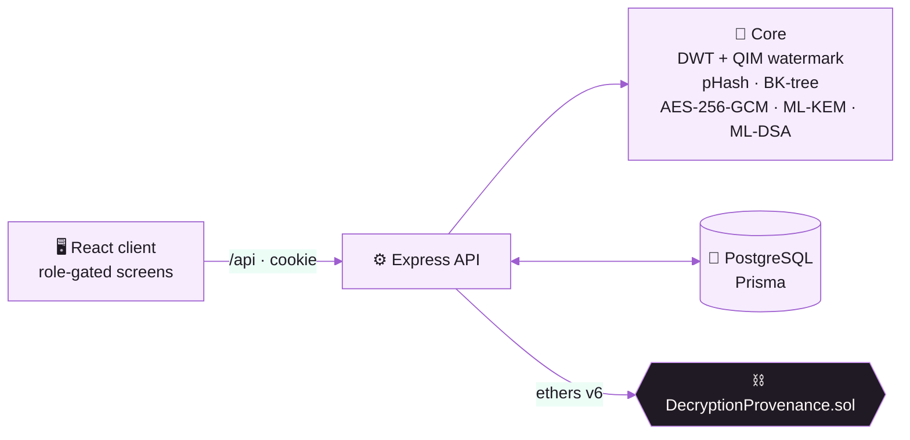
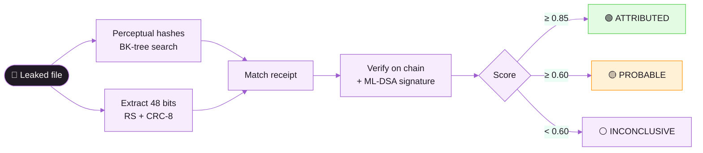
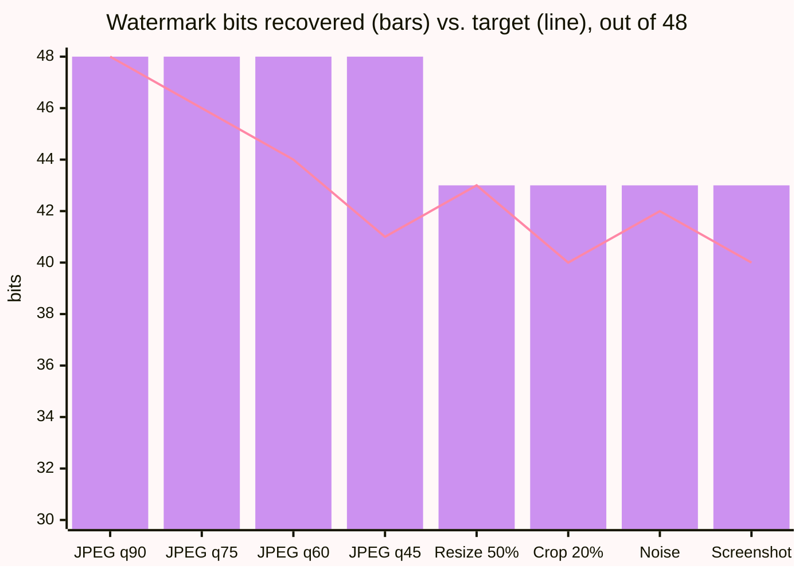

<div align="center">


<br/>


</div>

## ✦ What it does

When a protected file is decrypted, the system **anchors a receipt on a
blockchain**, then hides an **invisible, per-recipient watermark** in the copy.
If that copy leaks — compressed, cropped, or photographed off a screen — the mark
is recovered and matched back to its receipt. CPU only: no GPU, no model.


| Band              |    Score    | Meaning                              |
| :---------------- | :---------: | :----------------------------------- |
| 🟢 `ATTRIBUTED`   |   ≥ 0.85    | Report the match                     |
| 🟡 `PROBABLE`     | 0.60 – 0.85 | A lead, not a conclusion             |
| ⚪ `INCONCLUSIVE` |   < 0.60    | `match: null` — no name is ever sent |

## ⬡ Architecture



## ⟿ Trace flow



## ▲ Robustness



All 8 attacks pass at **48 dB PSNR** (visually identical) — `npm run attack:suite`.

## ◇ Roles

| Role           | Decrypt       | Trace | Why                                         |
| :------------- | :------------ | :---: | :------------------------------------------ |
| `ADMIN`        | anyone        |  ✅   | full custody                                |
| `OFFICER`      | **self only** |  ❌   | nobody investigates their own leak          |
| `INVESTIGATOR` | ❌            |  ✅   | cannot manufacture the leak they "discover" |

## ⚒ Tech stack

<div align="center">

</div>

<br/>

**Also:** Hardhat · ethers v6 · sharp · pdf-lib · Zod · `@noble/post-quantum`
(ML-KEM-768, ML-DSA-65) · TanStack Query · Recharts

## ⚡ Quick start

```bash
git clone https://github.com/hayan9104/Crypto-2.git && cd Crypto-2
npm run setup                                   # deps + Prisma client
# create .env — DATABASE_URL, MASTER_KEY_HEX, AUTH_SECRET, CHAIN_MODE, ...
docker run --name sih-pg -e POSTGRES_PASSWORD=dev -p 5432:5432 -d postgres:16
npm run db:migrate && npm run db:seed
npm run chain:node                              # terminal 1
npm run chain:deploy:local                      # terminal 2 → LOCAL_CONTRACT_ADDRESS
npm run dev                                     # API → :4000
npm run client:dev                              # UI  → :5173
```

Sign in as `admin@example.gov` / `admin123`. More in [`docs/`](docs/).

<div align="center">


<sub>Smart India Hackathon 2026 · SIH26237 · MIT License</sub>

</div>
